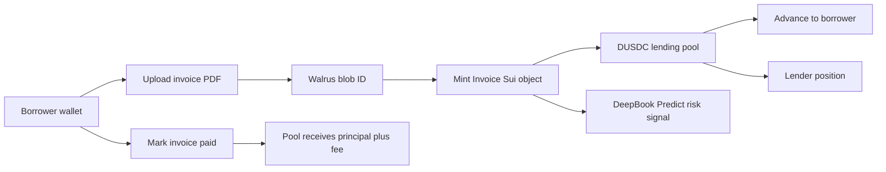

# Architecture

## Demo Flow

## Move Objects

`Invoice`

- `amount`
- `due_ms`
- `borrower`
- `debtor_hash`
- `walrus_blob_id`
- `status`
- `advance_bps`
- `discount_bps`
- `funded_principal`
- `expected_fee`

`LendingPool<T>`

- generic over the quote coin type
- stores `Balance<T>`
- supports deposit, owner withdraw, invoice funding, and settlement repayment

## Frontend Packages

- Mysten dApp boilerplate: `@mysten/create-dapp`
- Sui wallet and client: `@mysten/dapp-kit-react`, `@mysten/sui`
- Storage: `@mysten/walrus`
- Market infrastructure: `@mysten/deepbook-v3`
- State: `zustand`
- UI: `tailwindcss`, `shadcn`, `lucide-react`
- Forms: `react-hook-form`, `zod`

## Near-Term Implementation Plan

1. Complete the deterministic local demo path.
2. Install Sui CLI and compile the Move package.
3. Add Move unit tests for status transitions and pool accounting.
4. Add transaction builders in `web/src/lib/transactions.ts`.
5. Add Walrus upload implementation with testnet publisher or upload relay.
6. Deploy package to Sui Testnet and record package/pool IDs.
7. Replace placeholder package constants in `web/src/lib/protocol.ts`.
8. Add demo video script and submission metadata.

## Implemented Status

- React dApp dashboard is implemented with borrower, lender, and risk views.
- Walrus HTTP upload is implemented through the testnet publisher.
- Sui transaction builders are implemented for mint, list, create pool, deposit, fund, and settle.
- Wallet-signed app actions are wired for mint, pool creation, and funding when deployment IDs are configured.
- Move tests cover invoice listing and fund/settle accounting.
- Testnet package and shared DUSDC pool are deployed. The pool still needs DUSDC liquidity for live fund transactions.
