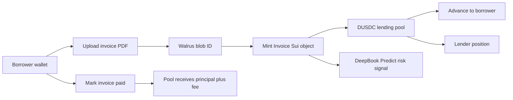

# Architecture

## Demo Flow

## Move Objects

`Invoice`

- `amount`
- `due_ms`
- `borrower`
- `debtor_hash`
- `walrus_blob_id`
- `status`
- `advance_bps`
- `discount_bps`
- `funded_principal`
- `expected_fee`

`LendingPool<T>`

- generic over the quote coin type
- stores `Balance<T>`
- supports deposit, owner withdraw, invoice funding, and settlement repayment

## Frontend Packages

- Mysten dApp boilerplate: `@mysten/create-dapp`
- Sui wallet and client: `@mysten/dapp-kit-react`, `@mysten/sui`
- Storage: `@mysten/walrus`
- Market infrastructure: `@mysten/deepbook-v3`
- Routing: `react-router-dom`
- Server state: `@tanstack/react-query`
- Demo workspace registry: browser local storage; authoritative financial state is reloaded from Sui
- UI: `tailwindcss`, `shadcn`, `lucide-react`
- Forms: `react-hook-form`, `zod`

## Implemented Status

- React dApp dashboard is implemented with borrower, lender, and risk views.
- Walrus HTTP upload is implemented through the testnet publisher.
- Sui transaction builders are implemented for mint, list, create pool, deposit, fund, and settle.
- Wallet-signed app actions are wired for pool creation, deposit, mint, funding, and settlement.
- Move tests cover invoice listing and fund/settle accounting.
- The current testnet package is `0x77224e…f747e` and the shared DUSDC pool is `0x89b3c6…473c`.
- The recorded end-to-end demo deposited 7 DUSDC, funded a 4.6 DUSDC advance, and settled the pool at 7.1365 DUSDC with no outstanding principal.
